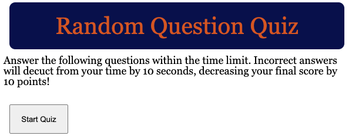

# Code Quiz

## Description

The motivation for building this project was to dive deeper into JavaScript and its relationship with the console and local storage. Utilizing functions, eventListeners, timers, and other essential features, this application was able to help me navigate learning more about JS.

This application quizzes users on trivia, related to Washington D.C. and beyond. 

I learned much about the syntax of JavaScript, more about how functions work, defining global vs. local variables, and begun learning about local storage. 

[Deployed-webpage](https://lparr30.github.io/code-quiz/)

## Usage

To use this application, click the "Start" button upon the webpage loading. Then, answer each question by selecting the appropriate answer choice. When you finish the quiz, or run out of time, enter your initials for your highscore to be saved!

